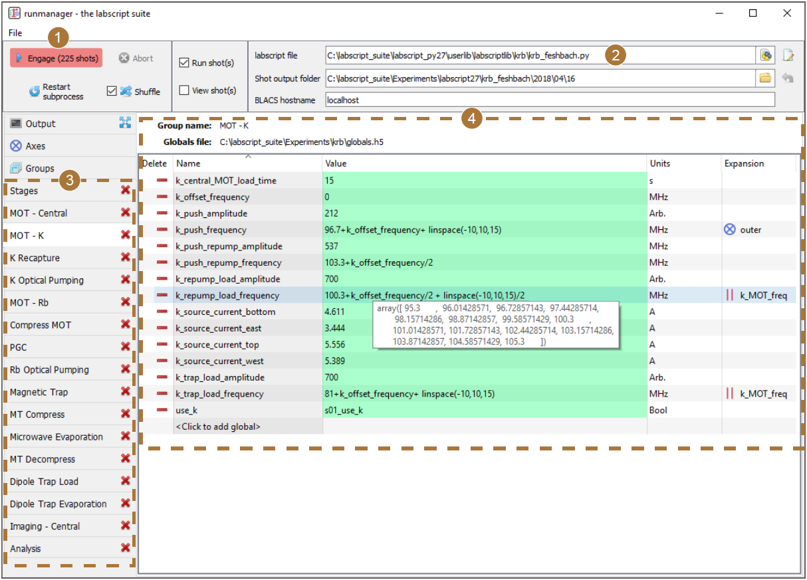

Introduction
============

Runmanager (see :numref:`fig-interface`) is the primary interface for adjusting the behaviour of the
experiment and generating shot files. Runmanager allows you to define parameters via
a graphical interface and select the experiment logic file to use. The parameters are inserted
into the experiment logic (as global variables) when shot generation is started via
the ‘Engage’ button.

The parameters can take the form of any Python data type that can be stored in a hdf5
file. When a parameter is specified as a list or array, runmanager automatically detects that
you wish to explore a parameter space. Runmanager will generate a separate shot for each
point in the array. If multiple arrays are specified across two or more parameters, runmanager
automatically takes the Cartesian product of those parameters in order to generate
shots that span the entire parameter space. For more complex experiments, parameters
can be linked together so they iterate in lock step by defining one or more zip groups. If
multiple zip groups are defined, the parameter space explored will be the Cartesian product
of each zip group and any other parameters containing an array or list.

.. _fig-interface:

    The runmanager interface, used to generate experiment shot files (1) using
    the experiment logic defined using the labscript API in a Python file (2) and groups of
    parameters (3), for example those shown for the ‘MOT - K’ group (4). Further details on
    the runmanager interface can be found in :doc:`Usage <usage>`.

.. rubric:: Footnotes

.. [1] Documentation taken from Starkey, Phillip T. *A software framework for control and automation of precisely timed experiments*
    PhD Thesis, Monash University (2019) https://doi.org/10.26180/5d1db8ffe29ef