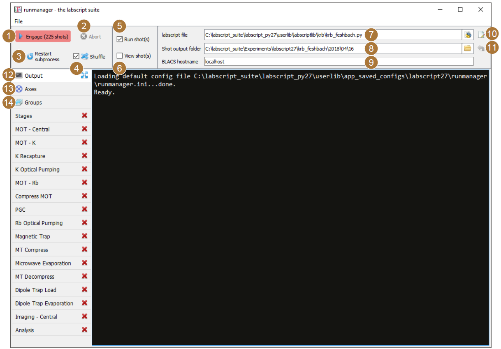
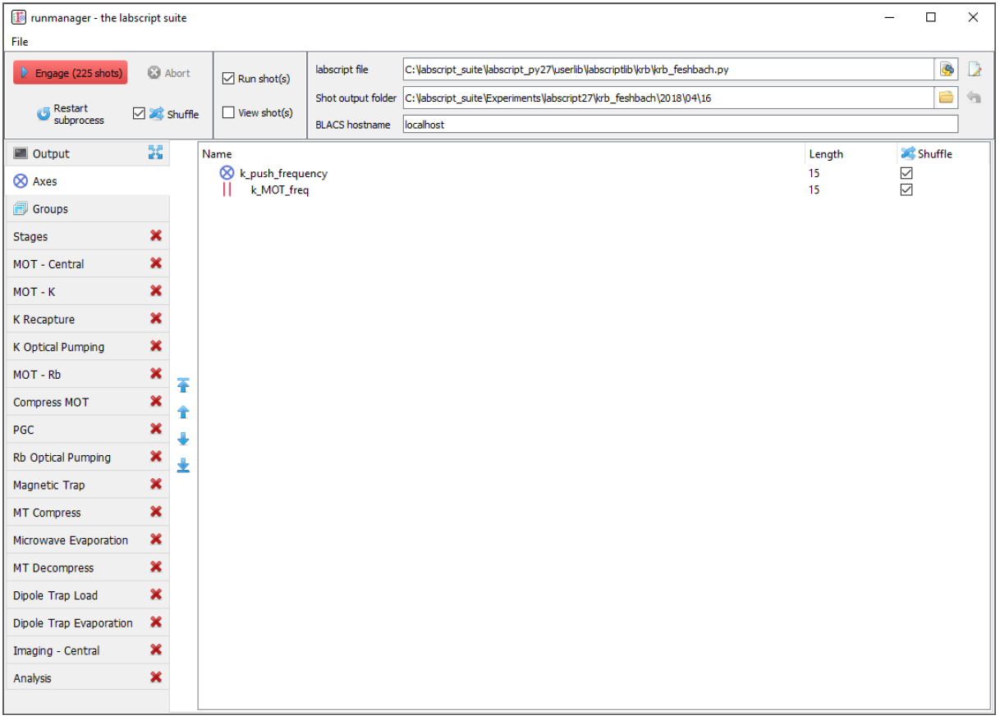
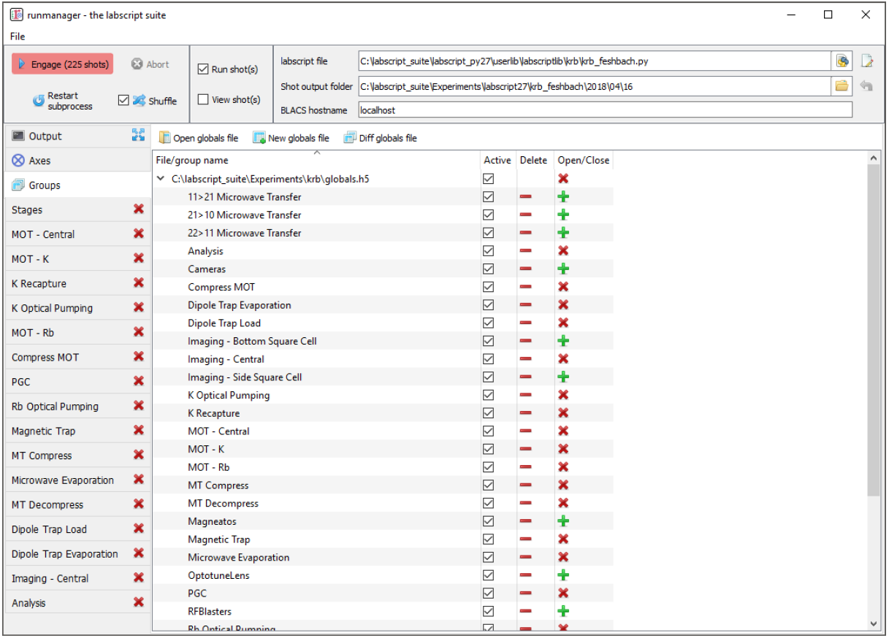
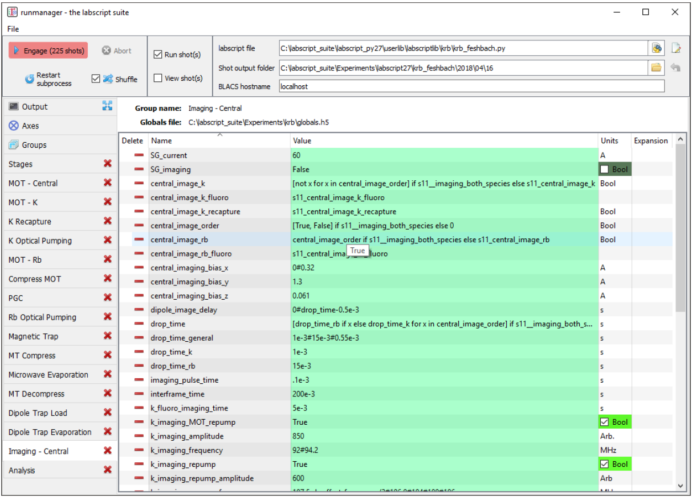
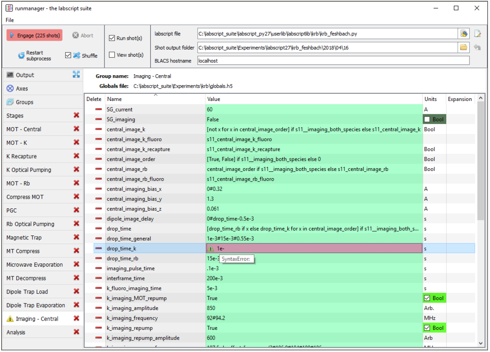
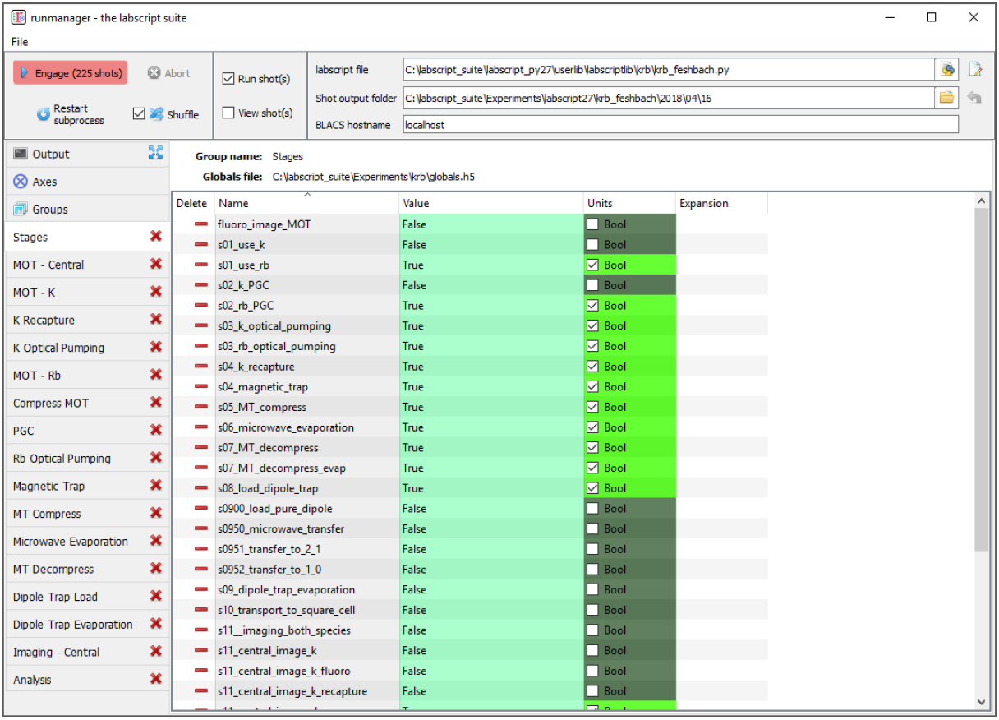

Usage
=====

Runmanager is the primary means of defining and managing the set of experiment parameters
(global variables - see §5.1.3) used in the labscript experiment logic. Runmanager also
handles the creation of each hdf5 shot file, and the invocation of labscript via the execution
of a user specified labscript experiment logic file.

The graphical interface
-----------------------

We believe that the manipulation of parameters, along with controls
for producing shots, are best implemented in a graphical interface. Critical information
on the current runmanager configuration, along with controls for generating new shots, are
located in a always visible toolbar at the top of the runmanager interface. These comprise
(as labelled in :numref:`fig-overview`):

.. _fig-overview:

    The runmanager graphical interface with the main controls labelled as per the
    below text. The ‘output’ tab is currently shown.

#.  The engage button: This begins production of the appropriate number of shot files.
    The number of shot files that will be produced is displayed prominently in the button
    text so that any mistakes made when defining the parameter space scan can be quickly
    corrected prior to beginning shot generation. This button can also be ‘clicked’ via the
    F5 key on a keyboard.
#.  The abort button: This stops the production of shot files prematurely.
#.  The restart subprocess button: Primarily for debugging and for use during labscript
    development, this button restarts the subprocess that manages the execution of the
    labscript experiment logic file, which in turn generates and stores hardware instructions
    inside the hdf5 file (see :ref:`usage:Shot creation`).
#.  The shuffle checkbox: This checkbox controls the global setting for whether parameter
    space scans are shuffled or not. This is a tri-state checkbox (all-some-none) displaying
    the current shuffle state on the axes tab. Clicking the checkbox will overwrite the
    state of each entry on the axes tab with the new state of the global checkbox. For
    more details, see :ref:`usage:Parameter space scans`.
#.  The run shots checkbox: If ticked prior to clicking the engage button, shot files will
    be sent immediately to the BLACS queue once the hardware instructions have been
    generated by labscript.
#.  The view shots checkbox: If ticked prior to clicking the engage button, shots will be
    sent to runviewer once the hardware instructions have been generated by labscript.
    Runviewer is assumed to be running locally, and will be launched if it is not already
    running once the first hdf5 file has been generated.
#.  The labscript file: The Python file containing the experiment logic to be compiled
    into hardware instructions (see :doc:`labscript <labscript:index>`).
#.  The shot output folder: The location to store the hdf5 shot files. By default, the
    location in specified by the combination of a value in the laboratory PC configuration
    file (see :doc:`labconfig <labscript-suite:labconfig>`), the name of the experiment logic Python file and
    the current date. The location automatically updates, at midnight, to a new folder
    for the day provided the folder location is left as the default.
#.  The BLACS hostname: The network hostname of the PC the hdf5 shot files are to
    be sent to if the ‘run shots’ checkbox is ticked. It is expected that BLACS is running
    on the specified PC, and that network access (including firewalls and other network
    access controls) is configured appropriately.
#.  The open in editor button: This button open the specified labscript experiment logic
    file in the text editor specified in the laboratory PC configuration file (see labconfig
    in the glossary).
#.  The reset shot output folder button: This button resets the shot output folder to
    the default. This will re-enable the auto incrementation of the folder (based on the
    current date), which is disabled for custom locations.

These controls provide rapid access to the key functionality of runmanager (creating and
distributing shot files) at all times, making for an efficient workflow.
The rest of the runmanager interface exists within a set of tabs. The first 3 tabs contain
further runmanager specific controls:

12. The output tab: This tab contains the terminal output of the shot creation process
    including the terminal output produced during the execution of the labscript experiment
    logic file. For example, Python `print` statements included in
    the experiment logic code will appear here during shot creation. This makes it easy
    to debug the experiment logic code using simple methods common to general purpose
    programming. Warnings and error messages generated by the labscript API also appear
    here in red text, so that any issues are immediately noticed and can be actioned.
    As this output is useful for debugging purposes, we allow the tab to be ‘popped out’
    into a separate window so it can be visible at the same time as another tab (to avoid
    the need to frequently switch between the output and the tab containing the global
    variable(s) you are currently modifying).
13. The axes tab: This tab allows the user to control the iteration order of the parameters
    in the defined parameter space (see :numref:`fig-axes`). The length of each axis of the
    parameter space is displayed, as is a shuffle checkbox for determining whether the
    points along that axis should be shuffled before the parameter space is expanded into
    the set of shots to be created. The global shuffle control (see item 4 in this list) is
    linked to the state of the shuffle checkboxes on the axes tab. This feature, along
    with the many benefits, is detailed further in :ref:`usage:Parameter space scans` (see feature 3 and the paragraphs
    following).
14. The groups tab: This tab manages the hdf5 files that store the globals (see :numref:`fig-groups`). 
    Further details on managing global variables will be discussed in :ref:`usage:Managing global variables`.

These tabs are then followed by an arbitrary number of tabs containing sets of global
variables, which will be discussed further in :ref:`usage:Managing global variables`.

.. _fig-axes:

    The ‘Axes’ tab of runmanager. This tab displays a list of all global variables
    (indicated by the blue outer product icon) or groups of global variables (indicated by the
    icon with red parallel bars) that form axes of the parameter space that will be scanned over
    (see item 13 and :ref:`usage:Parameter space scans` for further details). The order of the axes
    can be changed using the controls to the left of the list, which sets the order in which the
    outer product of the axes is performed (when generating the shot files).

In addition to this, runmanager can save and restore the entire GUI state via the
relevant menu items in the ‘File’ menu. This allows rapid switching between different types
of experiment logic and/or globals files. [2]_ This is particularly useful for shared experiment
apparatuses, where different users want to run different experiments, and for the cases
where a user wishes to rapidly switch between one of more diagnostic configurations they
have previously saved.

Managing global variables
-------------------------

Runmanager provides a simple interface for grouping and modifying global variables. As
mentioned previously, the ‘groups’ tab in runmanager handles creating and opening the
hdf5 files that store the global variables. There are two levels of organisation for global
variables:

* at the file level (globals can be stored across multiple files, the union of which is used
  to generate shots), and
* groups within each file.

.. _fig-groups:

    The ‘Groups’ tab of runmanager. This tab displays the groups of global
    variables (stored in hdf5 files) that have been loaded into runmanager. From this tab,
    users can enabled/disable the use of these globals when compiling shots (using the ‘active’
    checkboxes) and open/close an editing tab for each group. The editing tabs, when open, are
    displayed as additional tabs on the left most edge of the runmanager interface. See :ref:`usage:Managing global variables`
    for further details on managing globals.

Globals groups are created from the ‘groups’ tab in runmanager and can have arbitrary
names (including spaces and special symbols). The only requirement is that a group name
is unique within its file (it can however have the same name as a group in a different file).
Globals within a group are then only used in the creation of shots if the ‘active’ checkbox
for the group is checked on the groups tab (see :numref:`fig-groups`). This provides a simple way
of switching between different groups of globals, allowing labs to maintain a common set
of parameters for their experiments as well as individual parameter sets for specific users
and/or experiments. For example, rather than modifying a set of globals in a group, a user
could instead deactivate the group containing those globals, and instead ask runmanager to
pull those globals from a separate file.

Each group of globals can be opened for editing in a new tab. We provide columns
for the global name, value and units. The global name must be a :doc:`valid Python variable
name <python:reference/lexical_analysis>`, and must not conflict with any member of the pylab library, python keywords,
or existing items in the Python `__builtin__` module. This ensures that it can be injected
into the labscript experiment logic (see :doc:`labscript <labscript:index>`) without conflicting with existing Python
functionality. The global name must also be unique across all active groups, as global
groups are joined into a single set before passing the globals into the labscript experiment
logic.

The value of a global can be any Python expression (including the use of functions from
the numpy module), that evaluates to a datatype supported by hdf5, such as, but not
limited to:

* a number: `1234` or `780e-9`,
* a string: `'N_atoms'`,
* a list or numpy array (which will be treated as an axis of a parameter space to scan,
  where the global variable will contain only one of the elements of the list or array in
  each shot): `[1, 2, 3]` or `array([1, 2, 3])`,
* a tuple (which despite being list like, will not be treated as an axis of a parameter
  space to scan and will instead be passed into labscript as the tuple specified): `(1, 2, 3)`,
* a Boolean: `True` or `False`
* an equation: `1+2`
* a Python inbuilt, or numpy, function call that returns a valid value: `linspace(0, 10, 10)`,
* an expression that references another defined global variable by name (the value
  of this global variable is used in its place): `2*other_global` or `linspace(0, 10, other_global)`,
* a Boolean expression: `(other_global1 and other_global2)` or `(other_global3 == 7)` 
  or `(other_global4)`, or
* any of the above plus a Python comment: `780e-9 #This was previously 781e-9`.

As these expressions can become quite complex (see :numref:`fig-complex-globals`), the tooltip for the value
cells displays the evaluated result of the Python expression. The value cell is also colour
coded to the successful evaluation of the expression, so that mistakes can be easily identified
(see :numref:`fig-evaluation-error`).

.. _fig-complex-globals:

    An example of complex global variables that utilise Python expressions to define their value.
    Note, for example the `drop_time` global variable, whose full expression is shown below. The
    `drop_time` used is always drawn from one of three global variables, but the global variable selected
    is determined by a separate global variable (a Boolean) and may contain a list of drop times if
    the user wishes to image multiple species. In the case of the expression generating a list, this
    global becomes an axis of a parameter space, running two shots for every other data point in the
    parameter space (one shot to image each of the two species our experiment supports). Such an
    expression could not be defined within experiment logic as parameter spaces must be defined within
    runmanager, not labscript. In order to simplify the view of globals with complex expressions, the
    tooltip (shown for the `central_image_rb` global) shows the value(s) the global will take in the next
    compiled shot(s).

.. code-block:: python
    :caption: Full expression for `drop_time` global 

    [ drop_time_rb if x else drop_time_k for x in central_image_order ] if
    s11__imaging_both_species else ( drop_time_k if central_image_k == True
    else ( drop_time_rb if central_image_rb == True else drop_time_general))

The units of the global are not currently passed into the labscript experiment logic
code, but are a way to provide context to the user within runmanager. For example, if the
labscript experiment logic multiplied a global variable for a frequency by `1e6` everywhere
it was used (or the keyword argument `units="MHz"` was used everywhere), then you could
type ‘MHz’ into the units column of runmanager so that a later user would know that the
global was expected to be of that magnitude and would not accidentally enter it in kHz
or Hz. In addition to this, globals whose values are explicitly specified as either `True` or
`False` have their units automatically set to ‘Bool’, a checkbox is placed in the units column
for easy toggling, and the units cell is colour coded to this checkbox for easy observation
of the state. We frequently use this functionality to enable/disable various stages of our
experiment logic file (see :numref:`fig-bools`).

.. _fig-evaluation-error:

    An example of an evaluation error in a global variable. The user is notified of
    the error in two places: an icon appears next to the tab name and the global in question is
    highlighted in red. The tooltip displays the cause of the error, in this case a Python syntax
    error.

While we recommend storing globals in a dedicated set of files, the storage format for
the globals is identical to that in any shot, which allows a user to easily load in globals from
existing shots (even ones that have been executed and analysed). However, once pointed
at an existing shot file, any modification to globals will modify that shot file, thus partially
destroying the complete record of the experiment. [3]_ Thus, we encourage this feature to only
be used for the cases where you wish to look at the globals from an old shot or where you
wish to use the globals, without modification, to compile new shots.

.. _fig-bools:

    An example of how a labscript experiment can be parameterised by a series
    of Boolean global variables. Here we split up the production of a BEC into several stages.
    We name each global with a prefix that increments in order to keep the globals in an
    appropriate sort order. Runmanager detects the Boolean type of the global, and provides a
    simple checkbox toggle in the units column, By using these global variables in our labscript
    experiment logic file, as the Boolean expression for an if statement, we can quickly turn
    on/off various stages of the BEC production process (which is very useful when debugging
    or optimising the BEC production process).

Parameter space scans
---------------------

One of the key features of runmanager (and critical goals of our scientific control system)
is the ability to easily automate the traversal of a large parameter space, an increasingly
important requirement for performing modern ultracold atom experiments. Runmanager
provides four features for managing parameter space scans:

#.  The automatic detection of global variables that are defined as a list. [4]_ Such globals
    are labelled ‘outer’ in the expansions column as all such globals will be combined, via
    an outer product, into the parameter space to be scanned. The number of shots to be
    generated, which is simply the product of the lengths of all ‘outer’ product globals, is
    displayed next to the engage button.
#.  The ability to define what we term ‘zip groups’ after the Python function `zip`. Two (or
    more) globals (specified as lists) can be grouped together so that they iterate through
    values in lockstep. In this instance, the zip group is used as a single axis of the outer
    product rather than one axis for each global.
#.  The third feature is the ability to define the order in which the axes of the parameter
    space are iterated over when producing individual shots (see the ‘Axes’ tab discussed
    previously in :ref:`usage:The graphical interface`).
#.  The ability to randomly shuffle the order of values within each global (or zip group)
    defined as a list. This can be done on a per global basis or on the entire set of shots
    that spans the defined parameter space.

These features provide a powerful basis for performing complex experiments.

Consider the following example. Many of the early stages of BEC production (for
instance the MOT or magnetic trap stages) should be optimised for best phase-space density.
Phase space density is calculated from several parameters; the most important being atom
number and atom cloud temperature. While atom number can be easily measured from
an absorption image from a single shot, temperature is most commonly determined from
analysing the result of multiple shots. In this case, the drop time (the time between releasing
the atoms from the trap and taking the absorption image) is varied for each shot and the
temperature determined by fitting to the linearised relationship between atom cloud size
and drop time. Already, it can be seen that measuring the phase space density for a single
set of parameters requires several shots, which can be easily automated via the feature 1
described above.

Now consider the optimisation of MOT or magnetic trap parameters. Many of these are
coupled and can not be independently optimised. As such, it is preferable to optimise two
or three variables at once, measuring the phase-space density at each point to determine the
optimal set of parameters. Such a parameter space typically takes several hours to complete
due to the large number of shots that must be run. A BEC apparatus is likely to undergo
systematic drifts during this time, which may invalidate the results. However, with careful
thought, features 3 and 4 can be used to counteract this. For example, systematic drift will
effect the linearity of the data when determining temperature, especially if the acquisition
of each data point is separated by a significant period of time. However, by defining the
drop time to be the inner most item of the outer product, you ensure that all shots needed
to determine the phase-space density for a single set of MOT parameters are executed as
close together in time as possible. Shuffling the order of the drop time then eliminates short
term systematic drift, as does separately shuffling the order of the values in each remaining
axes of the outer product (the MOT parameters). If long term systematic drifts need to
be quantified, then an additional axes to the outer product can be added at the outer most
layer in order to repeat each of the shots a prescribed number of times (by defining an
additional ‘dummy’ global variable as `range(N)` where `N` is the number of times to repeat
each shot).

While the above example may seem complicated, runmanager makes it trivial to implement.
A user simply defines the list of values to scan over for each parameter, sets the order
in which the outer product should use each axis, and specifies whether the values for each
axis should be shuffled. Once done, clicking the engage button generates the sequence of
shots and sends them to BLACS to be executed on the experiment.

Evaluation of globals
---------------------

All global variable expressions are automatically evaluated after a change to any global
variable. This serves to both update the tooltip with the result of the expression, detect
axes of a parameter space to scan (and group them into zip groups if appropriate) and
warn the user of any errors during the evaluation of the globals. As discussed previously,
runmanager allows these global variable expressions to reference other global variables. This
allows a user to maintain a record of a set of parameters, and all relevant quantities derived
from one or more of those parameters, without ever storing a parameter more than once.
This ensures that important quantities need not be derived (from globals) in the labscript
experiment logic script, and that they are accessible directly during the analysis stage (see
:doc:`lyse <lyse:index>`).

To implement this, we take advantage of the Python built-in function exec which not
only evaluates a string containing a Python expression, but can do so from within a controlled
namespace. This has a two-fold benefit. The first is that it allows us to provide
access to a specific set of functions that can be used from within the Python expressions
(such as numpy functions like `linspace`). The second is that it allows us to keep track of the
relationship between global variables, which is critical for both descriptive error messages
and automatically detecting which globals should be combined into a zip groups.

The Python `exec` function is given access to a namespace to work in via an optional
argument in the form of a dictionary. Keys and values in this dictionary correspond to
variable names in the namespace and their associated values respectively. Rather than
using a native Python dictionary for the namespace, we subclass the Python dictionary
and override the built-in dictionary method for looking up entries in the dictionary. When
combined with exec, this translates to our `dict` subclasses tracking each time the `exec`
function requests the value of a variable in the namespace. This then provides us with a
mapping of each global variable, and the names of global variables that it depends on. In
order to resolve both the order in which global variable expressions are evaluated in, and
detection of any recursive relationships, we begin by evaluating all global expressions and
then recursively re-evaluate the set of globals that did not evaluate in the previous iteration.
The first iteration will evaluate any (correctly defined) independent globals, and subsequent
iterations will then be able to evaluate globals that depend on other globals (once those
other globals have been evaluated by a previous iteration).

The hierarchy of global interdependencies is then used to determine automatic zip group
names, which are based on the name of the global in the hierarchy that does not depend on
any other. If a global depends on multiple other globals, then the zip group name is chosen
semi-randomly based on the order of the items in the Python dictionary (which depends on
a hash of the dictionary key names and the size of the dictionary). However, it is of course
always possible to overwrite the automatic zip group name with something else should our algorithm choose incorrectly.

We believe that this complex evaluation of global variables is only possible due to the
use of an interpreted language that has tools for parsing its own syntax. As such, the
choice of Python as our programming language has allowed us to implement extremely
useful, advanced features that might otherwise be too difficult to produce in more low level
languages such as C++.

Shot creation
-------------

The internal process for generating shot files is quite complex. This is primarily motivated
by the desire for modularity (for example, to separate shot file generation from hardware
instruction generation) and the desire for robustness. As runmanager ultimately initiates the
execution of user code (the labscript experiment logic file), there is a risk that problems in the
user code could crash runmanager. We mitigate this by using a multi-process architecture.

We originally spawned a new Python process for each shot (in order to guarantee the
internal state of labscript was fresh). However the time required to start a Python process
(especially on Windows) was a considerable fraction of the entire shot generation time. As
such we now use a single, long-lived, Python process and clean-up the internal state of
labscript and Python explicitly after each shot.

To generate shot files, runmanager:

#.  Re-evaluates all globals (see :ref:`usage:Evaluation of globals`). This both determines the number of shots to
    produce, and generates the evaluated set of global variables for each shot.
#.  The globals are then written to hdf5 files, one file for each shot. We also write
    the unevaluated globals into every hdf5 file, in order to provide a complete record
    of the experiment (the unevaluated globals contain information about the parameter
    space that is not available when looking at the single point of parameter space in the
    evaluated globals of a single shot file).
#.  In a thread (in order to keep the GUI responsive), we iterate over the set of files
    and send their file paths to a long-running subprocess (launched by runmanager at
    startup) that is used to execute labscript code in an isolated environment. We call
    this process the ‘compilation subprocess’.
#.  The subprocess, which has the labscript API imported, calls an initialisation method
    to inform the labscript API of the hdf5 file to write hardware instructions to.
#.  The subprocess loads the global variables from runmanager into the `__builtin__`
    dictionary.
#.  The subprocess then executes the labscript experiment logic file (using the Python
    function `exec`) in an isolated namespace, which invokes the labscript API via the
    users experiment logic and generates the required hardware instructions and saves
    them in the hdf5 file. Terminal output (for example, `print` statements) are sent
    back to the parent runmanager process and placed in the output tab.
#.  The subprocess restores the `__builtin__` dictionary to its original state to prevent
    globals from polluting subsequent shots. A clean-up method from the labscript API
    is also called so that the internal state of the labscript Python module is also reset.

Once shot files are created, the file paths are sent to runviewer or BLACS, as determined by
the checkboxes in the runmanager GUI, for viewing and/or executing the shots respectively.
This architecture also has several unrealised benefits:

#.  If the need arose, we could easily parallelise the generation of hardware instructions
    by instantiating multiple instances of the compilation subprocess.
#.  We could use runmanager as a generic parameter (space) management software by
    replacing the compilation subprocess with something else. For example, runmanager
    could be used to manage parameters for simulations, producing one shot file per
    simulation to be run in the same way we do for real experiments. These files could
    then be sent to a scheduling program (like BLACS) that feeds them to the simulation
    software.

.. rubric:: Footnotes

.. [1] Documentation taken from Phillip T. Starkey *A software framework for control and automation of precisely timed experiments*
    Thesis, Monash University (2019) https://doi.org/10.26180/5d1db8ffe29ef

.. [2] For clarity, the values of the globals are not saved in this configuration file, but simply the location
    of the hdf5 file containing the globals. This means that any globals in files shared between saved
    runmanager configurations will share their values. For cases where global values should differ between
    runmanager configurations, separate globals files should be used.

.. [3] Note that in an executed shot file, globals exist in two formats: the evaluated format (one point in the
    parameter space) used by labscript, and the raw strings as displayed in runmanager. Only the latter
    would be overwritten if globals were edited in the manor described in the main body text.

.. [4] Runmanager considers both Python lists and numpy arrays to be what we refer to as ‘lists’ in this
    section.
